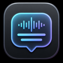

# Live Subtitles



A lightweight native macOS menu-bar app that captions system audio in real time and can show an English translation on a second line.

## Features

- Native SwiftUI menu-bar app and floating subtitle overlay
- Live system-audio transcription with Apple Speech
- Optional on-device English translation
- Configurable language, text size, and background opacity
- No accounts, analytics, servers, or API keys

## Build

Requires macOS 15+ and Xcode 16+.

1. Open `LiveSubtitles.xcodeproj`.
2. Select your development team under **Signing & Capabilities**.
3. Build and run the `LiveSubtitles` scheme.
4. Choose **Start Captions** from the menu-bar icon and approve the requested privacy permissions.

macOS ties privacy permissions to the app's code signature. During development, use a stable signing identity and run one installed copy to avoid stale permission entries.

## Install from GitHub Releases

Local releases are ad-hoc signed and have not been reviewed or notarized by Apple. Only continue if you trust this repository and the specific release you downloaded.

1. Download `LiveSubtitles-<version>-local.dmg` and its matching `.dmg.sha256` file from GitHub Releases.
2. In Terminal, verify the download:

   ```sh
   cd ~/Downloads
   shasum -a 256 -c LiveSubtitles-<version>-local.dmg.sha256
   ```

3. Open the DMG and drag **LiveSubtitles** to **Applications**.
4. Try to open LiveSubtitles from Applications.
5. If macOS blocks it, open **System Settings → Privacy & Security**, scroll to **Security**, click **Open Anyway**, authenticate, then confirm **Open**. Apple makes this option available for about one hour after the blocked launch attempt.
6. Use the captions icon in the menu bar to select **Start Captions**, then approve Speech Recognition, Microphone, and Screen & System Audio Recording access.

Do not disable Gatekeeper or run quarantine-removal commands. See [Apple's instructions for opening an unnotarized app](https://support.apple.com/guide/mac-help/mh40617/mac).

## Local release without notarization

You do not need an Apple Developer membership for a local build:

```sh
./scripts/build-local.sh
```

This creates a universal Apple Silicon/Intel app and two ad-hoc signed artifacts:

- `build/LocalRelease/LiveSubtitles.app`
- `dist/LiveSubtitles-<version>-local.dmg`
- `dist/LiveSubtitles-<version>-local.dmg.sha256`
- `dist/LiveSubtitles-<version>-local.zip`
- `dist/LiveSubtitles-<version>-local.zip.sha256`

Local artifacts are suitable for development and personal use, but they are not notarized and may be blocked by Gatekeeper on other Macs. Rebuilding changes the ad-hoc code identity, so macOS may ask for privacy permissions again. Use the notarized release flow for public distribution.

For a GitHub local release, upload the DMG and its `.sha256` file. The ZIP and its checksum are optional alternatives for users who do not want a disk image.

Tag pushes automate this process. The tag must be `v` followed by the app's `MARKETING_VERSION`:

```sh
git tag v1.0
git push origin v1.0
```

The GitHub Actions workflow builds the DMG on macOS, verifies the version, and publishes the DMG plus its checksum as release assets.

## Notarized release

The release script requires Apple Developer Program membership, a **Developer ID Application** certificate in Keychain, and stored `notarytool` credentials.

```sh
xcrun notarytool store-credentials livesubtitles-notary \
  --apple-id "you@example.com" \
  --team-id "YOURTEAMID"

DEVELOPMENT_TEAM="YOURTEAMID" ./scripts/notarize-release.sh
```

Set `NOTARY_PROFILE` if you use a different Keychain profile name. The script produces two notarized and stapled artifacts:

- `dist/LiveSubtitles-<version>.dmg` with an Applications shortcut
- `dist/LiveSubtitles-<version>.zip`

## Privacy

Audio flows directly from ScreenCaptureKit to Apple's Speech framework. Supported languages use on-device recognition; translation uses Apple's downloaded Translation models. The app contains no networking or telemetry code.

## License

[MIT](LICENSE)
